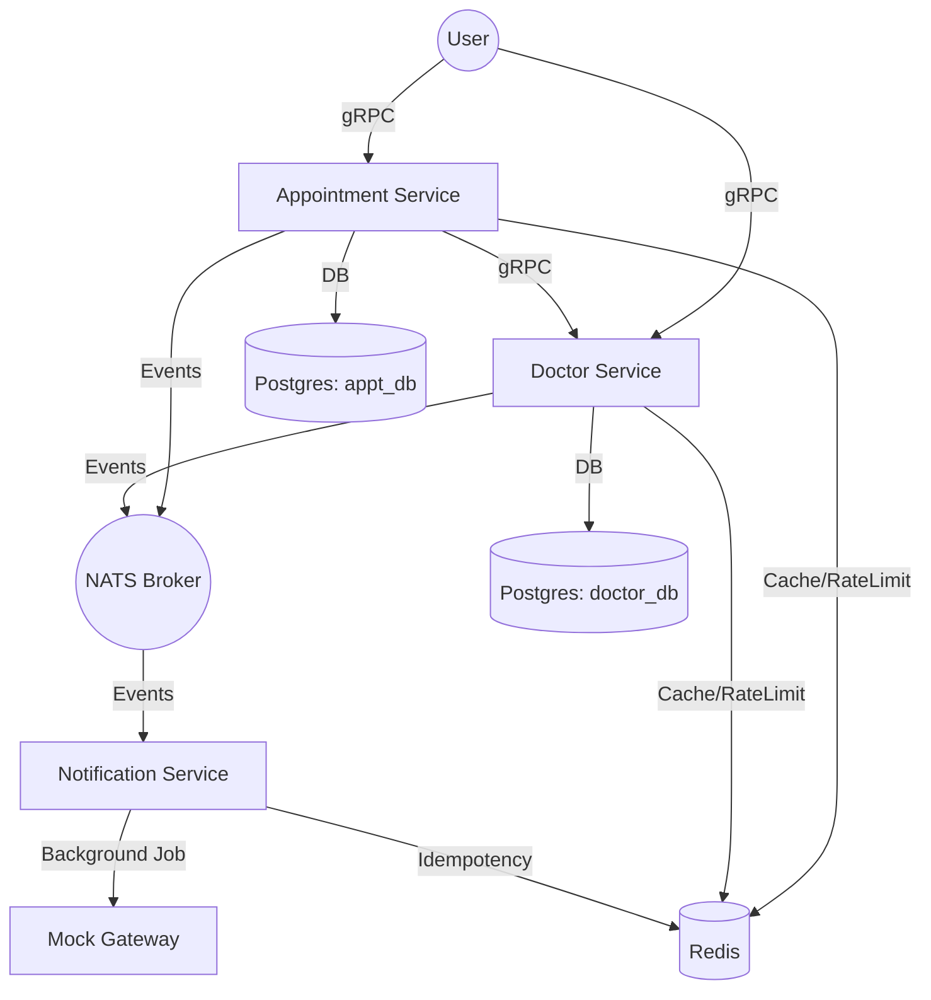
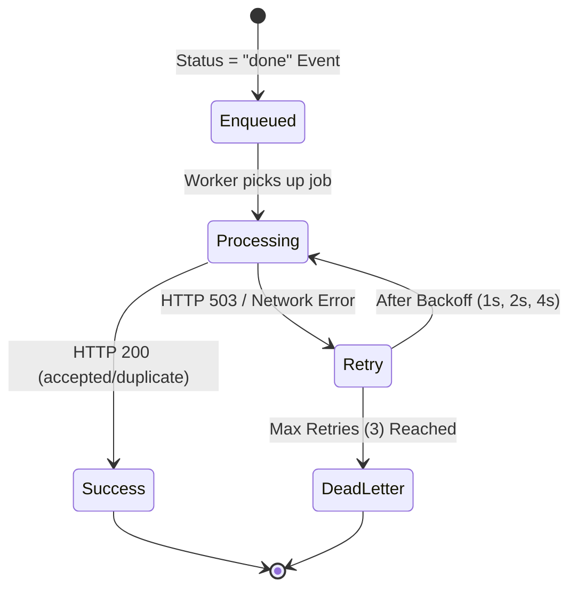

# Medical Scheduling Platform - Assignment 4: Caching & Background Jobs

## Overview
This version of the Medical Scheduling Platform adds production-readiness features:
1.  **Caching**: Redis-backed caching layer for Doctor and Appointment services.
2.  **Rate Limiting**: gRPC interceptors using Redis to protect against overload.
3.  **Background Jobs**: Worker-pool based job queue in the Notification Service for asynchronous processing of "done" appointments.
4.  **Mock Gateway**: Simulated external notification API with idempotency and transient failure simulation.

## Architecture
The system consists of four services, two PostgreSQL databases, a Redis instance, and a NATS broker.



## Caching Strategy
| Service | Operation | Strategy | Key Pattern | TTL |
| --- | --- | --- | --- | --- |
| Doctor | GetDoctor | Cache-Aside | `doctor:<id>` | `CACHE_TTL_SECONDS` |
| Doctor | ListDoctors | Cache-Aside | `doctors:list` | `CACHE_TTL_SECONDS` |
| Doctor | CreateDoctor | Write-Through | `doctors:list` (Invalidate) | Immediate |
| Appt | GetAppointment| Cache-Aside | `appointment:<id>` | `CACHE_TTL_SECONDS` |
| Appt | ListAppointments| Cache-Aside | `appointments:list` | `CACHE_TTL_SECONDS` |
| Appt | CreateAppt | Write-Around | `appointments:list` (Invalidate) | Immediate |
| Appt | UpdateStatus | Write-Through | `appointment:<id>`, `list` | Immediate |

**Choice Rationale:**
- **Cache-Aside** is used for reads to minimize DB load while keeping logic simple.
- **Write-Through/Around** invalidations ensure consistency after writes.

## Rate Limiting
- **Algorithm**: Sliding Window Counter using Redis `ZSET`.
- **Reasoning**: Unlike fixed-window, sliding window prevents bursts at the edge of window boundaries.
- **Storage**: Redis `ZSET` where members and scores are nanosecond timestamps.
- **Default**: 100 requests per minute per client IP.

## Background Job Queue
- **Architecture**: In-process worker pool using Go channels.
- **Worker Pool**: Configurable via `WORKER_POOL_SIZE` (default: 3).
- **Idempotency**: SHA-256 hash of `event_type + id + occurred_at` stored in Redis (24h TTL).
- **Retry Logic**: Exponential backoff (1s, 2s, 4s) up to 3 attempts.
- **Dead-Letter**: After 3 failures, job details are logged to `stderr` in JSON format.

### Job Lifecycle State Diagram


## Environment Variables
| Variable | Description | Example |
| --- | --- | --- |
| `REDIS_URL` | Redis connection string | `redis://localhost:6379` |
| `CACHE_TTL_SECONDS` | Default TTL for cache | `60` |
| `RATE_LIMIT_RPM` | Max requests per minute | `100` |
| `GATEWAY_URL` | Mock Gateway address | `http://localhost:8080` |
| `WORKER_POOL_SIZE` | Number of workers | `3` |
| `GATEWAY_PORT` | Mock Gateway listen port | `8080` |

## Infrastructure Setup
```bash
# Start Postgres, NATS, and Redis
docker-compose up -d
```

## Service Startup Order
1. **Mock Gateway**: `cd mock-gateway && go run .`
2. **Doctor Service**: `cd doctor-service && go run .`
3. **Appointment Service**: `cd appointment-service && go run .`
4. **Notification Service**: `cd notification-service && go run ./cmd/notification-service`

## Testing & Verification
### Checkpoint 1: Cache Hit
1. Call `GetDoctor` with ID.
2. Observe `redis-cli MONITOR` showing a `GET` (miss) followed by `SET`.
3. Call again. Observe only `GET` (hit).

### Checkpoint 2: Rate Limiter
1. Send 101 requests within a minute.
2. Receive `codes.ResourceExhausted`.

### Checkpoint 3: Job Queue
1. Update appointment status to `done`.
2. Observe Notification Service logs: `enqueued` -> `processing` -> `success`.
3. Observe Mock Gateway logs for the `POST /notify` request.

### Checkpoint 4: Idempotency
1. Trigger the same `done` status update again.
2. Observe Notification Service log: `status = "dropped"` with error `already processed`.
3. Verify no second request reaches the Mock Gateway.

### Checkpoint 5: Dead Letter
1. Stop the Mock Gateway binary.
2. Trigger an appointment status update to `done`.
3. Observe 3 `retry` attempts followed by a `dead_letter` entry on `stderr`.

## Cache Consistency Trade-offs
- **Stale Reads**: A small window of staleness exists if the cache invalidation fails (handled as best-effort). The `CACHE_TTL_SECONDS` act as a safety net to ensure eventual consistency.
- **Cache Stampede / Thundering Herd**: If a highly popular key (e.g., `doctors:list`) expires, multiple requests might hit the DB simultaneously. In a production system, **singleflight** or **distributed locks** would be used to ensure only one request populates the cache.
- **Distributed Cache**: Using Redis ensures consistency across multiple service instances. However, if using **Redis Cluster**, one must ensure keys used in the same pipeline/transaction belong to the same hash slot.

## Rate-Limiting Trade-offs (Scaling)
In a horizontally scaled system, per-instance rate limiting has limitations:
1. **Inaccurate Global Limits**: If you have 5 instances and a limit of 100 RPM, the total allowed traffic is 500 RPM, which might overwhelm the DB.
2. **Uneven Distribution**: A client might be blocked on instance A but allowed on instance B if the load balancer isn't perfectly round-robin.
**Solution**: Our Redis-backed implementation solves this by using a **centralized counter**, ensuring that the 100 RPM limit is enforced globally across all service instances.

## Dead-Letter Strategy
- **Current**: Logged to `stderr` as structured JSON for visibility in log aggregators (e.g., ELK, Datadog).
- **Production**:
    1. **DLQ (Dead Letter Queue)**: Move failed jobs to a separate NATS stream or RabbitMQ queue for manual inspection.
    2. **Alerting**: Trigger a PagerDuty/Slack alert when a job reaches the Dead-Letter state.
    3. **Admin UI**: Provide a dashboard for developers to "replay" failed jobs after fixing the underlying issue (e.g., gateway outage).
