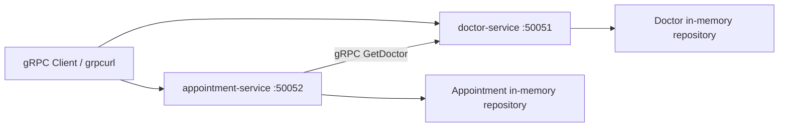

# AP2 Assignment 2: Medical Scheduling Platform over gRPC

## Project Overview
This project migrates a two-service medical scheduling platform from REST to gRPC while preserving Clean Architecture and keeping business logic isolated from transport concerns.

Services:
- `doctor-service`: owns doctor profiles
- `appointment-service`: owns appointments and validates doctor existence by calling `doctor-service` over gRPC

Clean Architecture boundaries in both services:
- `model` / `domain`: entities and business errors
- `usecase`: application business rules
- `repository`: in-memory persistence
- `transport/grpc`: delivery layer only, responsible for proto mapping and gRPC status codes
- `app`: dependency wiring and server startup

## Repository Structure
```text
assignment1/
├── doctor-service/
│   ├── cmd/doctor-service/main.go
│   ├── main.go
│   ├── go.mod
│   ├── internal/
│   │   ├── app/
│   │   ├── model/
│   │   ├── repository/
│   │   ├── transport/grpc/
│   │   └── usecase/
│   └── proto/
│       ├── doctor.proto
│       ├── doctor.pb.go
│       └── doctor_grpc.pb.go
├── appointment-service/
│   ├── cmd/appointment-service/main.go
│   ├── main.go
│   ├── go.mod
│   ├── internal/
│   │   ├── app/
│   │   ├── client/
│   │   ├── model/
│   │   ├── repository/
│   │   ├── transport/grpc/
│   │   └── usecase/
│   └── proto/
│       ├── appointment.proto
│       ├── appointment.pb.go
│       └── appointment_grpc.pb.go
└── README.md
```

## gRPC Contracts
- Doctor proto: `doctor-service/proto/doctor.proto`
- Appointment proto: `appointment-service/proto/appointment.proto`

Implemented RPCs:
- `DoctorService.CreateDoctor`
- `DoctorService.GetDoctor`
- `DoctorService.ListDoctors`
- `AppointmentService.CreateAppointment`
- `AppointmentService.GetAppointment`
- `AppointmentService.ListAppointments`
- `AppointmentService.UpdateAppointmentStatus`

## Architecture Diagram


## Architecture Decisions
1. Only the transport layer was migrated from REST to gRPC.
2. Use cases do not import protobuf-generated code.
3. Proto ↔ domain mapping is done only inside `internal/transport/grpc`.
4. `appointment-service` uses a dedicated gRPC client adapter hidden behind the `DoctorClient` interface.
5. The appointment use case never constructs a gRPC client itself; it receives the abstraction via dependency injection.
6. Server reflection is enabled in both services so `grpcurl` can be used as a testing artifact.
7. Both services keep `main.go` at the service root, so each one still starts with `go run .`.

## Business Rules Implemented
- `CreateDoctor`
  - `full_name` is required
  - `email` is required
  - `email` must be unique
- `GetDoctor`
  - returns `NotFound` when the doctor ID does not exist
- `CreateAppointment`
  - `title` is required
  - `doctor_id` is required
  - calls `doctor-service` over gRPC before creating the appointment
- `UpdateAppointmentStatus`
  - valid statuses: `new`, `in_progress`, `done`
  - `done -> new` transition is forbidden
- `GetAppointment`
  - returns `NotFound` when the appointment ID does not exist

## gRPC Error Handling Strategy
The delivery layer converts domain/usecase errors into gRPC status codes.

| Situation | gRPC code |
|---|---|
| Missing required field | `InvalidArgument` |
| Email already exists | `AlreadyExists` |
| Doctor not found in doctor-service | `NotFound` |
| Doctor Service unreachable from appointment-service | `Unavailable` |
| Doctor does not exist during remote validation | `FailedPrecondition` |
| Invalid appointment status | `InvalidArgument` |
| Forbidden `done -> new` transition | `InvalidArgument` |
| Appointment not found | `NotFound` |

Failure handling details:
- `appointment-service` calls `DoctorService.GetDoctor`
- if the call returns `NotFound`, the use case rejects creation/update with `FailedPrecondition`
- if the call fails due to connection or transport issues, the use case rejects with `Unavailable`
- no appointment is created or updated when doctor validation fails

## How to Run Locally
Open two terminals.

1. Start `doctor-service` first:
```bash
cd doctor-service
go run .
```

2. Start `appointment-service` second:
```bash
cd appointment-service
go run .
```

Default ports:
- `doctor-service`: `50051`
- `appointment-service`: `50052`

Environment variables:
- `DOCTOR_SERVICE_PORT` for `doctor-service` server port
- `APPOINTMENT_SERVICE_PORT` for `appointment-service` server port
- `DOCTOR_SERVICE_ADDR` for the remote doctor gRPC endpoint used by `appointment-service`

Default `DOCTOR_SERVICE_ADDR`:
```text
localhost:50051
```

## Regenerating Proto Stubs
Requirements:
- `protoc`
- `protoc-gen-go`
- `protoc-gen-go-grpc`

Install generators:
```bash
go install google.golang.org/protobuf/cmd/protoc-gen-go@latest
go install google.golang.org/grpc/cmd/protoc-gen-go-grpc@latest
```

Generate doctor stubs into `doctor-service/proto`:
```bash
cd doctor-service
protoc --proto_path=proto --go_out=proto --go_opt=paths=source_relative --go-grpc_out=proto --go-grpc_opt=paths=source_relative proto/doctor.proto
```

Generate appointment stubs into `appointment-service/proto`:
```bash
cd appointment-service
protoc --proto_path=proto --go_out=proto --go_opt=paths=source_relative --go-grpc_out=proto --go-grpc_opt=paths=source_relative proto/appointment.proto
```

After generation, ensure these files are present:
- `doctor-service/proto/doctor.pb.go`
- `doctor-service/proto/doctor_grpc.pb.go`
- `appointment-service/proto/appointment.pb.go`
- `appointment-service/proto/appointment_grpc.pb.go`

## Testing Artifact: grpcurl Commands
Because server reflection is enabled, the platform can be tested with `grpcurl`.

List doctor RPCs:
```bash
grpcurl -plaintext localhost:50051 list
```

Create doctor:
```bash
grpcurl -plaintext -d '{"full_name":"Dr. Aisha Seitkali","specialization":"Cardiology","email":"a.seitkali@clinic.kz"}' localhost:50051 doctor.DoctorService/CreateDoctor
```

Get doctor:
```bash
grpcurl -plaintext -d '{"id":"doctor-1"}' localhost:50051 doctor.DoctorService/GetDoctor
```

List doctors:
```bash
grpcurl -plaintext -d '{}' localhost:50051 doctor.DoctorService/ListDoctors
```

Create appointment:
```bash
grpcurl -plaintext -d '{"title":"Initial cardiac consultation","description":"Patient referred","doctor_id":"doctor-1"}' localhost:50052 appointment.AppointmentService/CreateAppointment
```

Get appointment:
```bash
grpcurl -plaintext -d '{"id":"appointment-1"}' localhost:50052 appointment.AppointmentService/GetAppointment
```

List appointments:
```bash
grpcurl -plaintext -d '{}' localhost:50052 appointment.AppointmentService/ListAppointments
```

Update appointment status:
```bash
grpcurl -plaintext -d '{"id":"appointment-1","status":"in_progress"}' localhost:50052 appointment.AppointmentService/UpdateAppointmentStatus
```

Remote doctor validation failure:
```bash
grpcurl -plaintext -d '{"title":"Bad appointment","description":"Should fail","doctor_id":"doctor-404"}' localhost:50052 appointment.AppointmentService/CreateAppointment
```

Expected result:
- gRPC `FailedPrecondition`

Dependency unavailable failure:
1. Stop `doctor-service`
2. Call:
```bash
grpcurl -plaintext -d '{"title":"Follow-up","description":"Doctor service down","doctor_id":"doctor-1"}' localhost:50052 appointment.AppointmentService/CreateAppointment
```

Expected result:
- gRPC `Unavailable`

## REST vs gRPC Trade-offs
1. Protocol and payload format
   REST usually sends human-readable JSON over HTTP, which is easy to inspect manually.
   gRPC uses HTTP/2 with compact binary Protocol Buffers payloads.
   Choose REST when readability and public-web compatibility matter more; choose gRPC when service-to-service efficiency matters more.
2. Contract definition
   REST can work without a strict schema, and teams often rely on documentation or conventions.
   gRPC requires a strict `.proto` contract, and both client and server are generated from that shared schema.
   Choose REST when you want looser integration and quick experimentation; choose gRPC when you want stronger type safety and fewer contract mismatches.
3. Performance
   REST with JSON is usually larger on the wire and involves more text serialization overhead.
   gRPC with protobuf is typically faster and lighter for internal microservice communication.
   Choose REST when performance is not a bottleneck; choose gRPC when the platform has frequent internal RPC calls or tighter latency requirements.
4. Streaming support
   REST is mostly request-response unless you add extra patterns such as polling, SSE, or WebSockets.
   gRPC has built-in support for unary, server-streaming, client-streaming, and bidirectional streaming RPCs.
   Choose REST for simple CRUD APIs; choose gRPC when streaming or long-lived service communication is part of the design.
5. Tooling and ecosystem
   REST is easier to explore with browsers, Postman, and plain `curl`.
   gRPC is stronger when you want generated clients, strict stubs, and typed internal integrations, with tools such as `grpcurl`.
   Choose REST for public-facing APIs consumed by many different clients; choose gRPC for internal backend communication where generated tooling is a benefit.

## Verification Performed
- `go test ./...` passed in both services
- both services started with `go run .`
- verified with live gRPC calls:
  - doctor creation succeeded
  - appointment creation succeeded
  - invalid remote doctor returned `FailedPrecondition`
  - doctor-service downtime returned `Unavailable`
